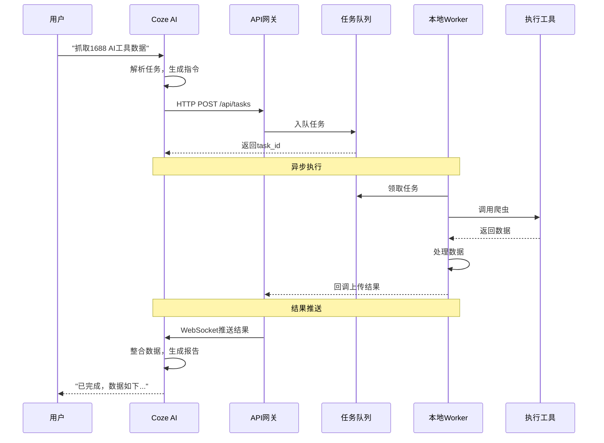
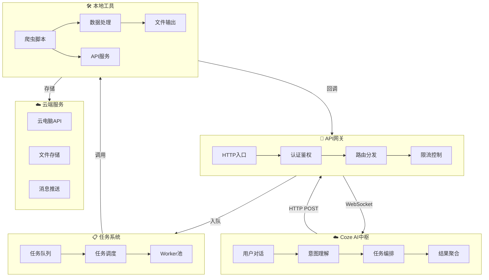

# 平台协作架构设计

> 创建时间：2026-04-20
> 版本：v1.0
> 目标：Coze作为AI中枢，指挥本地/云端工具执行任务

---

## 一、架构概述

### 1.1 设计目标

```
┌─────────────────────────────────────────────────────────────────┐
│                         用户 (钟钟)                              │
│                    "帮我抓取1688上AI工具的数据"                     │
└─────────────────────────────────────────────────────────────────┘
                                │
                                ▼
┌─────────────────────────────────────────────────────────────────┐
│                      Coze AI中枢 (主控)                          │
│  ┌─────────┐  ┌─────────┐  ┌─────────┐  ┌─────────┐              │
│  │ 意图识别 │→│ 任务拆解 │→│ 指令生成 │→│ 结果整合 │              │
│  └─────────┘  └─────────┘  └─────────┘  └─────────┘              │
└─────────────────────────────────────────────────────────────────┘
                                │
                    ┌───────────┴───────────┐
                    ▼                       ▼
         ┌─────────────────┐      ┌─────────────────┐
         │   本地工具层      │      │   云端服务层      │
         │  ┌───────────┐  │      │  ┌───────────┐  │
         │  │ 爬虫脚本   │  │      │  │ 云电脑API  │  │
         │  │ Trae IDE  │  │      │  │ WebSocket │  │
         │  │ 剪映      │  │      │  │ 文件存储   │  │
         │  └───────────┘  │      │  └───────────┘  │
         └─────────────────┘      └─────────────────┘
                    │                       │
                    └───────────┬───────────┘
                                ▼
                    ┌─────────────────────┐
                    │   数据返回通道       │
                    │  (文件/HTTP/WebSocket)│
                    └─────────────────────┘
```

### 1.2 核心能力矩阵

| 能力项 | 说明 | 实现方式 |
|--------|------|----------|
| **任务下发** | Coze向工具发送任务指令 | HTTP POST / WebSocket |
| **状态同步** | 实时获取任务执行状态 | WebSocket / 轮询 |
| **结果回传** | 工具将数据返回Coze | WebSocket / 文件+通知 |
| **错误处理** | 异常情况处理与重试 | 回调重试 + 死信队列 |
| **多任务并发** | 支持并行执行多个任务 | 消息队列 + 任务管理 |

---

## 二、详细架构设计

### 2.1 整体调用链路



### 2.2 组件交互图



---

## 三、接口设计文档

### 3.1 核心API列表

| 方法 | 路径 | 说明 |
|------|------|------|
| POST | `/api/v1/tasks` | 创建任务 |
| GET | `/api/v1/tasks/{task_id}` | 查询任务状态 |
| POST | `/api/v1/tasks/{task_id}/cancel` | 取消任务 |
| GET | `/api/v1/tasks/{task_id}/result` | 获取任务结果 |
| POST | `/api/v1/webhook/callback` | 工具回调接口 |
| WS | `/api/v1/ws/{client_id}` | WebSocket实时通道 |
| GET | `/api/v1/health` | 健康检查 |

### 3.2 接口详细定义

#### 3.2.1 创建任务

```yaml
POST /api/v1/tasks
Content-Type: application/json
X-API-Key: your_api_key

Request:
{
  "task_type": "crawler",           # 任务类型
  "platform": "1688",                # 目标平台
  "action": "search_products",      # 具体动作
  "params": {
    "keywords": ["AI工具", "智能助手"],
    "pages": 2,
    "filters": {
      "min_price": 100,
      "max_price": 10000
    }
  },
  "notify_url": "https://coze.cn/api/webhook/xxx",  # 回调URL（可选）
  "priority": 5,                    # 优先级 1-10
  "timeout": 300                    # 超时时间（秒）
}

Response:
{
  "code": 0,
  "message": "success",
  "data": {
    "task_id": "task_20260420143000_abc123",
    "status": "queued",
    "estimated_time": 60,
    "websocket_url": "wss://api.example.com/api/v1/ws/task_20260420143000_abc123"
  }
}
```

#### 3.2.2 查询任务状态

```yaml
GET /api/v1/tasks/{task_id}
X-API-Key: your_api_key

Response:
{
  "code": 0,
  "message": "success",
  "data": {
    "task_id": "task_20260420143000_abc123",
    "status": "running",           # queued/running/completed/failed/cancelled
    "progress": 65,               # 进度百分比
    "stage": "抓取第2页",
    "created_at": "2026-04-20T14:30:00+08:00",
    "started_at": "2026-04-20T14:30:05+08:00",
    "result_url": null            # 完成后才有值
  }
}
```

#### 3.2.3 获取任务结果

```yaml
GET /api/v1/tasks/{task_id}/result
X-API-Key: your_api_key

Response:
{
  "code": 0,
  "message": "success",
  "data": {
    "task_id": "task_20260420143000_abc123",
    "status": "completed",
    "summary": {
      "total_items": 80,
      "platform": "1688",
      "crawl_duration": 45
    },
    "files": [
      {
        "type": "json",
        "name": "products_1688_20260420.json",
        "url": "https://storage.example.com/results/xxx.json",
        "size": 45678
      }
    ],
    "data_preview": [
      {
        "title": "AI智能客服机器人",
        "price": "2999.00",
        "sales": 856
      }
    ]
  }
}
```

#### 3.2.4 工具回调接口

```yaml
POST /api/v1/webhook/callback
Content-Type: application/json

Request:
{
  "task_id": "task_20260420143000_abc123",
  "event": "task_completed",       # task_started/task_progress/task_completed/task_failed
  "timestamp": "2026-04-20T14:35:00+08:00",
  "data": {
    "status": "completed",
    "output_files": ["/data/products.json"],
    "summary": {"count": 80}
  },
  "signature": "sha256=xxx"        # 签名验证
}

Response:
{
  "code": 0,
  "message": "received"
}
```

### 3.3 WebSocket消息格式

```yaml
# 客户端连接
WS /api/v1/ws/{client_id}?task_id={task_id}&token={token}

# 服务器推送消息
{
  "type": "message",
  "message_type": "task_progress",  # task_progress/task_result/task_error
  "task_id": "task_20260420143000_abc123",
  "data": {
    "progress": 65,
    "stage": "正在解析第2页数据",
    "items_crawled": 52
  },
  "timestamp": "2026-04-20T14:32:30+08:00"
}

# 任务完成推送
{
  "type": "message",
  "message_type": "task_result",
  "task_id": "task_20260420143000_abc123",
  "data": {
    "status": "completed",
    "result_url": "https://storage.example.com/results/xxx.json",
    "total_items": 80
  },
  "timestamp": "2026-04-20T14:35:00+08:00"
}

# 错误推送
{
  "type": "message",
  "message_type": "task_error",
  "task_id": "task_20260420143000_abc123",
  "data": {
    "error_code": "PROXY_EXHAUSTED",
    "error_message": "代理池耗尽，请稍后重试",
    "can_retry": true
  },
  "timestamp": "2026-04-20T14:33:00+08:00"
}
```

---

## 四、通信方案对比

### 4.1 方案对比矩阵

| 方案 | 实时性 | 实现复杂度 | 可靠性 | 适用场景 | 推荐度 |
|------|--------|------------|--------|----------|--------|
| **HTTP轮询** | 低 | ⭐ | ⭐⭐⭐ | 简单查询 | ⭐⭐ |
| **HTTP回调** | 中 | ⭐⭐ | ⭐⭐⭐⭐ | 异步任务 | ⭐⭐⭐⭐ |
| **WebSocket** | 高 | ⭐⭐⭐ | ⭐⭐⭐⭐⭐ | 实时状态 | ⭐⭐⭐⭐⭐ |
| **Server-Sent Events** | 高 | ⭐⭐ | ⭐⭐⭐⭐ | 单向推送 | ⭐⭐⭐ |
| **消息队列(MQ)** | 高 | ⭐⭐⭐⭐ | ⭐⭐⭐⭐⭐ | 高并发 | ⭐⭐⭐⭐ |

### 4.2 推荐方案：混合架构

```
┌────────────────────────────────────────────────────────────────┐
│                     Coze AI中枢                                │
└────────────────────────────────────────────────────────────────┘
                          │
          ┌───────────────┼───────────────┐
          ▼               ▼               ▼
    ┌──────────┐    ┌──────────┐    ┌──────────┐
    │  简单指令 │    │  异步任务 │    │  实时监控 │
    │  (轮询)  │    │  (回调)  │    │(WebSocket)│
    └──────────┘    └──────────┘    └──────────┘
```

**场景选择策略：**

| 场景 | 推荐方案 | 理由 |
|------|----------|------|
| 快速查询（状态/列表） | HTTP轮询 | 简单，无需长连接 |
| 爬虫/数据抓取 | HTTP回调 | 耗时任务，完成后通知 |
| 视频剪辑进度 | WebSocket | 实时进度更新 |
| 大批量任务调度 | 消息队列 | 高并发，削峰填谷 |
| 文件上传/下载 | 直接存储 | 大文件不走API |

---

## 五、Coze端实现

### 5.1 Coze工作流设计

```yaml
# Coze工作流：crawler_workflow.json
name: "数据抓取工作流"
description: "调用本地爬虫获取电商数据"

nodes:
  - id: start
    type: start
    output: user_input
  
  - id: parse_intent
    type: llm
    prompt: |
      解析用户意图，提取以下信息：
      1. 目标平台 (1688/闲鱼/拼多多)
      2. 搜索关键词
      3. 抓取页数
      4. 数据筛选条件
      
      输出JSON格式
  
  - id: call_api
    type: http_request
    method: POST
    url: "https://your-api.com/api/v1/tasks"
    headers:
      Content-Type: "application/json"
      X-API-Key: "${env.API_KEY}"
    body: "${parse_intent.output}"
  
  - id: monitor_task
    type: websocket
    url: "${call_api.output.websocket_url}"
    on_message:
      - if: "message.message_type == 'task_result'"
        then:
          - type: end
            output: "${message.data}"
      - if: "message.message_type == 'task_error'"
        then:
          - type: error
            output: "${message.data.error_message}"
      - if: "message.message_type == 'task_progress'"
        then:
          - type: reply
            message: "已抓取 ${message.data.items_crawled} 条数据，进度 ${message.data.progress}%"
  
  - id: end
    type: end
    output_type: json
```

### 5.2 Coze代码块集成

```javascript
// Coze代码块：调用爬虫API
async function callCrawlerAPI(platform, keywords, pages) {
  const API_BASE = "https://your-api.com/api/v1";
  const API_KEY = process.env.CRAWLER_API_KEY;
  
  // 1. 创建任务
  const createResponse = await fetch(`${API_BASE}/tasks`, {
    method: "POST",
    headers: {
      "Content-Type": "application/json",
      "X-API-Key": API_KEY
    },
    body: JSON.stringify({
      task_type: "crawler",
      platform: platform,
      action: "search_products",
      params: {
        keywords: keywords,
        pages: pages
      }
    })
  });
  
  const taskData = await createResponse.json();
  const taskId = taskData.data.task_id;
  
  // 2. 轮询等待结果（简单场景）
  // 复杂场景使用WebSocket
  let status = "queued";
  while (status === "queued" || status === "running") {
    await sleep(3000); // 3秒轮询
    
    const statusResponse = await fetch(`${API_BASE}/tasks/${taskId}`, {
      headers: { "X-API-Key": API_KEY }
    });
    
    const statusData = await statusResponse.json();
    status = statusData.data.status;
    
    if (status === "running") {
      console.log(`进度: ${statusData.data.progress}%`);
    }
  }
  
  // 3. 获取结果
  if (status === "completed") {
    const resultResponse = await fetch(`${API_BASE}/tasks/${taskId}/result`, {
      headers: { "X-API-Key": API_KEY }
    });
    
    return await resultResponse.json();
  } else {
    throw new Error(`任务失败: ${status}`);
  }
}

// 辅助函数
function sleep(ms) {
  return new Promise(resolve => setTimeout(resolve, ms));
}

// 使用示例
const result = await callCrawlerAPI("1688", ["AI工具", "智能助手"], 2);
console.log(`抓取到 ${result.data.summary.total_items} 条数据`);
```

### 5.3 Coze插件配置

```yaml
# Coze插件：crawler_plugin.json
name: "数据抓取助手"
description: "抓取1688、闲鱼、拼多多等平台商品数据"

actions:
  - name: search_1688
    description: "搜索1688商品"
    parameters:
      - name: keywords
        type: string[]
        required: true
        description: "搜索关键词"
      - name: pages
        type: number
        default: 1
        description: "抓取页数"
      - name: filters
        type: object
        description: "筛选条件"
    
  - name: search_xianyu
    description: "搜索闲鱼商品"
    parameters:
      - name: keywords
        type: string[]
      - name: pages
        type: number

  - name: search_pinduoduo
    description: "搜索拼多多商品"
    parameters:
      - name: keywords
        type: string[]
      - name: pages
        type: number

triggers:
  - pattern: "(.*)1688(.*)"
    action: search_1688
  - pattern: "(.*)闲鱼(.*)"
    action: search_xianyu
  - pattern: "(.*)拼多多(.*)"
    action: search_pinduoduo
```

---

## 六、本地Worker实现

### 6.1 Worker服务架构

```python
# worker/main.py
import asyncio
import aiohttp
import hashlib
import time
from pathlib import Path
from typing import Optional
import json

class TaskWorker:
    """任务执行Worker"""
    
    def __init__(self, worker_id: str, api_base: str):
        self.worker_id = worker_id
        self.api_base = api_base
        self.current_task = None
        self.session: Optional[aiohttp.ClientSession] = None
    
    async def start(self):
        """启动Worker"""
        self.session = aiohttp.ClientSession()
        print(f"[Worker {self.worker_id}] 启动")
        
        while True:
            try:
                # 1. 获取任务
                task = await self.fetch_task()
                
                if task:
                    await self.execute_task(task)
                else:
                    # 无任务时等待
                    await asyncio.sleep(5)
                    
            except Exception as e:
                print(f"[Worker {self.worker_id}] 异常: {e}")
                await asyncio.sleep(10)
    
    async def fetch_task(self) -> Optional[dict]:
        """从任务队列获取任务"""
        url = f"{self.api_base}/api/v1/worker/claim"
        
        async with self.session.get(
            url,
            params={"worker_id": self.worker_id}
        ) as resp:
            if resp.status == 200:
                data = await resp.json()
                if data.get("code") == 0:
                    return data.get("data")
            return None
    
    async def execute_task(self, task: dict):
        """执行任务"""
        task_id = task["task_id"]
        task_type = task["task_type"]
        params = task["params"]
        
        print(f"[Worker {self.worker_id}] 开始执行任务 {task_id}")
        
        try:
            # 发送开始通知
            await self.send_progress(task_id, "started", {"message": "任务开始"})
            
            # 根据任务类型执行
            if task_type == "crawler":
                result = await self.run_crawler(task_id, params)
            elif task_type == "video_edit":
                result = await self.run_video_edit(task_id, params)
            else:
                raise ValueError(f"未知任务类型: {task_type}")
            
            # 发送完成通知
            await self.send_result(task_id, result)
            
        except Exception as e:
            print(f"[Worker {self.worker_id}] 任务 {task_id} 失败: {e}")
            await self.send_error(task_id, str(e))
    
    async def run_crawler(self, task_id: str, params: dict):
        """运行爬虫"""
        # 导入爬虫模块
        from platforms.crawler_1688 import Alibaba1688Crawler
        from platforms.crawler_xianyu import XianyuCrawler
        from platforms.crawler_pinduoduo import PinduoduoCrawler
        
        platform = params.get("platform")
        keywords = params.get("keywords", [])
        pages = params.get("pages", 1)
        
        crawlers = {
            "1688": Alibaba1688Crawler,
            "xianyu": XianyuCrawler,
            "pinduoduo": PinduoduoCrawler,
        }
        
        crawler_class = crawlers.get(platform)
        if not crawler_class:
            raise ValueError(f"不支持的平台: {platform}")
        
        crawler = crawler_class()
        
        # 分阶段执行并发送进度
        all_results = []
        for page in range(1, pages + 1):
            products = await crawler.search(keywords[0], 1)
            all_results.extend(products)
            
            # 发送进度
            progress = int(page / pages * 100)
            await self.send_progress(task_id, "running", {
                "progress": progress,
                "stage": f"抓取第{page}页",
                "items_crawled": len(all_results)
            })
        
        # 保存结果
        output_file = await self.save_results(task_id, platform, all_results)
        
        return {
            "status": "completed",
            "total_items": len(all_results),
            "files": [output_file]
        }
    
    async def save_results(self, task_id: str, platform: str, data: list) -> str:
        """保存结果到文件"""
        output_dir = Path(__file__).parent.parent / "outputs" / "tasks" / task_id
        output_dir.mkdir(parents=True, exist_ok=True)
        
        filepath = output_dir / f"{platform}_products.json"
        
        with open(filepath, 'w', encoding='utf-8') as f:
            json.dump({
                "task_id": task_id,
                "platform": platform,
                "crawl_time": time.strftime("%Y-%m-%dT%H:%M:%S+08:00"),
                "total": len(data),
                "products": data
            }, f, ensure_ascii=False, indent=2)
        
        return str(filepath)
    
    async def send_progress(self, task_id: str, status: str, data: dict):
        """发送进度更新"""
        url = f"{self.api_base}/api/v1/tasks/{task_id}/progress"
        
        await self.session.post(url, json={
            "status": status,
            "worker_id": self.worker_id,
            **data
        })
    
    async def send_result(self, task_id: str, result: dict):
        """发送任务结果"""
        url = f"{self.api_base}/api/v1/tasks/{task_id}/complete"
        
        await self.session.post(url, json={
            "worker_id": self.worker_id,
            "result": result
        })
    
    async def send_error(self, task_id: str, error: str):
        """发送错误"""
        url = f"{self.api_base}/api/v1/tasks/{task_id}/error"
        
        await self.session.post(url, json={
            "worker_id": self.worker_id,
            "error": error
        })

# 启动Worker
if __name__ == "__main__":
    import uuid
    
    worker = TaskWorker(
        worker_id=f"worker_{uuid.uuid4().hex[:8]}",
        api_base="https://your-api.com"
    )
    
    asyncio.run(worker.start())
```

### 6.2 Worker部署

```bash
# systemd服务配置
# /etc/systemd/system/crawler-worker.service

[Unit]
Description=Crawler Worker Service
After=network.target

[Service]
Type=simple
User=crawler
WorkingDirectory=/home/crawler/worker
ExecStart=/usr/bin/python3 /home/crawler/worker/main.py
Restart=always
RestartSec=10
Environment="PYTHONPATH=/home/crawler"

[Install]
WantedBy=multi-user.target
```

```bash
# 启动多个Worker实例
sudo systemctl enable crawler-worker
sudo systemctl start crawler-worker

# 创建worker@1, worker@2等服务实例
for i in 1 2 3 4 5; do
    sudo cp /etc/systemd/system/crawler-worker.service \
           /etc/systemd/system/crawler-worker@${i}.service
done

sudo systemctl daemon-reload
sudo systemctl start crawler-worker@{1..5}
```

---

## 七、安全设计

### 7.1 认证机制

```yaml
# 1. API Key认证
X-API-Key: your_api_key_here

# 2. HMAC签名（推荐）
X-Signature: sha256=hmac_sha256(
    secret_key,
    timestamp + method + path + body
)
X-Timestamp: 1713580800

# 3. JWT Token（WebSocket）
Authorization: Bearer <jwt_token>
```

### 7.2 限流策略

```yaml
# 限流配置
rate_limits:
  # 未认证
  anonymous:
    requests_per_minute: 10
    burst: 20
  
  # 标准API Key
  standard:
    requests_per_minute: 60
    burst: 100
  
  # 高级API Key
  premium:
    requests_per_minute: 300
    burst: 500
  
  # WebSocket连接数
  websocket:
    connections_per_key: 5
    messages_per_second: 10
```

---

## 八、部署架构

### 8.1 推荐部署方案

```
                          ┌─────────────────┐
                          │   用户请求       │
                          └────────┬────────┘
                                   │
                                   ▼
                    ┌──────────────────────────────┐
                    │      云服务器 (2核4G)         │
                    │  ┌──────────────────────┐   │
                    │  │   Nginx 反向代理       │   │
                    │  └──────────┬───────────┘   │
                    │             │               │
                    │  ┌──────────┴───────────┐   │
                    │  │   API Gateway         │   │
                    │  │   - 认证              │   │
                    │  │   - 限流              │   │
                    │  │   - 路由              │   │
                    │  └──────────┬───────────┘   │
                    │             │               │
                    │  ┌──────────┴───────────┐   │
                    │  │   FastAPI Server      │   │
                    │  │   - 任务管理          │   │
                    │  │   - WebSocket         │   │
                    │  │   - 文件服务          │   │
                    │  └──────────┬───────────┘   │
                    │             │               │
                    │  ┌──────────┴───────────┐   │
                    │  │   Redis (任务队列)    │   │
                    │  └──────────┬───────────┘   │
                    └─────────────┼───────────────┘
                                  │
              ┌───────────────────┼───────────────────┐
              │                   │                   │
              ▼                   ▼                   ▼
    ┌─────────────────┐ ┌─────────────────┐ ┌─────────────────┐
    │   Worker 1      │ │   Worker 2      │ │   Worker N      │
    │   云电脑1       │ │   云电脑2       │ │   本地机器      │
    │   (爬虫)        │ │   (视频处理)   │ │   (备用)       │
    └─────────────────┘ └─────────────────┘ └─────────────────┘
```

### 8.2 快速部署脚本

```bash
#!/bin/bash
# deploy.sh - 一键部署脚本

set -e

echo "=== 开始部署数据抓取系统 ==="

# 1. 安装依赖
echo "[1/6] 安装系统依赖..."
apt update && apt install -y python3.10 python3-pip nginx redis-server

# 2. 安装Python包
echo "[2/6] 安装Python包..."
pip3 install fastapi uvicorn aiohttp beautifulsoup4 lxml redis python-jose

# 3. 创建目录
echo "[3/6] 创建目录..."
mkdir -p /opt/crawler/{api,worker,outputs,logs}

# 4. 配置Redis
echo "[4/6] 配置Redis..."
systemctl enable redis
systemctl start redis

# 5. 启动API服务
echo "[5/6] 启动API服务..."
cd /opt/crawler/api
nohup python3 -m uvicorn main:app --host 0.0.0.0 --port 8000 > /opt/crawler/logs/api.log 2>&1 &

# 6. 启动Worker
echo "[6/6] 启动Worker..."
for i in 1 2 3; do
    cd /opt/crawler/worker
    nohup python3 main.py > /opt/crawler/logs/worker_${i}.log 2>&1 &
done

echo "=== 部署完成 ==="
echo "API地址: http://your-server:8000"
echo "API文档: http://your-server:8000/docs"
```

---

## 九、扩展计划

### 9.1 功能扩展

| 阶段 | 功能 | 优先级 |
|------|------|--------|
| v1.0 | 1688/闲鱼/拼多多爬虫 | P0 |
| v1.1 | 视频剪辑任务支持 | P1 |
| v1.2 | 定时任务调度 | P1 |
| v2.0 | 多云电脑分布式 | P2 |
| v2.1 | AI自动数据分析 | P2 |
| v2.2 | 可视化报表生成 | P3 |

### 9.2 性能优化

```yaml
# 性能目标
performance:
  # 任务响应
  task_creation_latency: < 100ms
  task_completion_latency: < 5s (小任务)
  
  # 吞吐量
  concurrent_tasks: 100
  requests_per_second: 1000
  
  # 资源
  max_worker_instances: 20
  max_concurrent_websockets: 500
```

---

> 📌 **更新记录**
> - v1.0 (2026-04-20): 初始版本，包含完整架构设计、接口文档、实现方案
